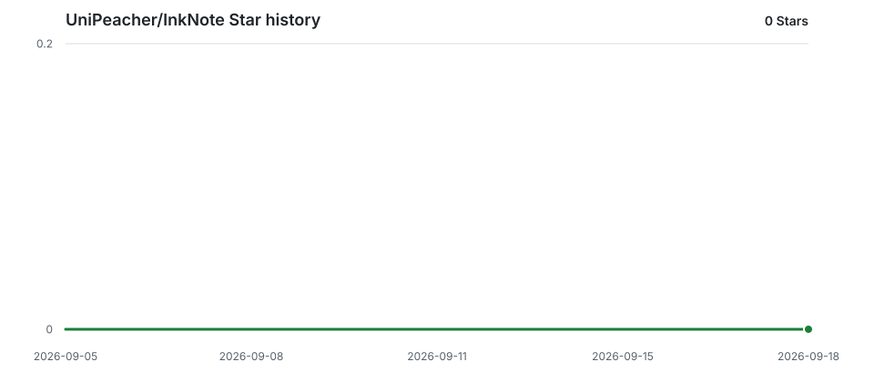

<h1 align="center">InkNote</h1>

<p align="center"><strong>ローカルファースト。普通の文書を書くように使える Markdown エディター。</strong></p>

<p align="center">
  <a href="README.md">English</a> |
  <a href="README.zh-CN.md">简体中文</a> |
  <a href="README.zh-TW.md">繁體中文</a> |
  日本語 |
  <a href="README.ko.md">한국어</a>
</p>

<p align="center">
  <a href="https://github.com/likehao19/InkNote/releases/latest"></a>
  <a href="https://github.com/likehao19/InkNote/actions/workflows/ci.yml"></a>
  <a href="https://github.com/likehao19/InkNote/releases"></a>
  <a href="https://github.com/likehao19/InkNote/stargazers"></a>
  <a href="LICENSE"></a>
</p>

<p align="center">
  <a href="https://likehao19.github.io/InkNote/">Web サイト</a> ·
  <a href="https://github.com/likehao19/InkNote/releases/latest">ダウンロード</a> ·
  <a href="https://github.com/likehao19/InkNote/issues">Issue</a>
</p>

<p align="center">
  
</p>

## この fork の新機能

上流 [likehao19/InkNote](https://github.com/likehao19/InkNote) に対する修正版の追加要素:

- **ブラウザー式の文書タブ** — タブはいくつでも開けます。新規タブのスタートページと **+** ボタン付きのタブバー、未保存の変更はドットで表示、中クリックや × で閉じます。同じファイルが 2 つのタブで開くことはありません。
- **ドラッグ＆ドロップで即編集** — `.md` ファイルを 1 つでも複数でもウィンドウにドロップすれば、そのまま編集を始められます。
- **最近使ったファイルは編集時刻順** — 最近リストは開いた順ではなく最終更新時刻順に並び、ディスク上の変更で自動的に更新されます。
- **さらに軽いメモリ使用量** — KaTeX は文書に数式が含まれるときだけ読み込みます（Mermaid やエクスポートも既に遅延読み込み）。
- **編集体験の修正** — 編集への切り替えでスクロール位置を保持、ライブプレビューで空行を保持、アウトラインと旧エンコーディング（GBK、UTF-16 など）の同期。
- **整えたアプリアイコン** — 全プラットフォームで標準のアイコングリッド余白に準拠。

## Markdown ファイルはそのまま、記法のわずらわしさは少なく

InkNote は文書を標準のローカル Markdown ファイルとして保存しながら、一般的な文書エディターに近い執筆体験を提供します。入力中に整形結果を確認でき、複雑なブロックはその場で編集でき、必要なときはいつでも完全なソースへ切り替えられます。

- **ローカルファースト**：アカウントも必須クラウドも文書アップロードも不要です。
- **高い可搬性**：通常の `.md` ファイルなので、ほかの Markdown ツールでも開けます。
- **安全に開く**：新規・既存のすべての文書に **プレビュー / 編集** アクセス切り替えを表示し、意図しない変更を防ぎます。
- **実用的な文書向け**：アウトライン、ワークスペース、検索、エクスポート、数式、図表、テーブル、コードを一つの流れで扱えます。

## 2 つの編集スタイル

<table>
  <tr>
    <td width="50%"></td>
    <td width="50%"></td>
  </tr>
  <tr>
    <td align="center"><strong>ライブプレビューと完全なソース</strong><br />整形済みの文書を直接編集することも、Markdown ソース全体を確認・編集することもできます。</td>
    <td align="center"><strong>自分に合うエディター</strong><br />ライト、ダーク、システム連動、Markdown テーマ、文字組み、カスタム CSS を選べます。</td>
  </tr>
</table>

## 主な機能

### 執筆と書式

- 必要なときだけ Markdown 記法を見せるライブプレビュー編集。
- 見出し、リスト、引用、リンク、画像、タスクリスト、脚注、GFM テーブル。
- 太字、斜体、取り消し線、ハイライト、インラインコード、下線、上付き・下付き文字。
- 集中モードとタイプライターモード。

### 技術文書

- シンタックスハイライト、行番号、コピーボタン付きコードブロック。
- KaTeX のインライン数式とブロック数式。
- Mermaid のフローチャート、シーケンス図など。
- テーブル、コード、数式、図、画像、YAML front matter のインプレース編集。

### 整理と検索

- 複数のワークスペースフォルダー、ファイルツリー状態の保持、ファイル操作。
- ブラウザー式の文書タブ：新規タブのスタートページ、未保存の変更はドットで表示、中クリックや × で閉じる。
- 文書アウトライン、最終編集時刻で並び替えた最近使ったファイル、クイックオープン。
- 現在の文書内での検索と置換。
- ファイル名と内容を対象にしたワークスペース横断検索と結果への移動。

### 出力とカスタマイズ

- 文書全体を単体の HTML または PDF としてエクスポート。
- ライト、ダーク、システム連動の外観。
- GitHub、Vue、Minimal の Markdown テーマとカスタム CSS。
- Markdown ファイル関連付け、ドラッグ＆ドロップで開く（複数ファイルを一度にドロップしてすぐ編集）、アプリ内アップデート確認。
- アプリ UI は英語と簡体字中国語に対応。

## ダウンロード

| プラットフォーム | パッケージ | アーキテクチャ |
| --- | --- | --- |
| Windows | [インストーラー](https://github.com/UniPeacher/InkNote/releases/download/patched/InkNote-Windows-x64.exe) | x64 |
| macOS | [Apple シリコン版 DMG](https://github.com/likehao19/InkNote/releases/latest/download/InkNote-macOS-arm64.dmg) | ARM64 |
| macOS | [Intel 版 DMG](https://github.com/likehao19/InkNote/releases/latest/download/InkNote-macOS-x86_64.dmg) | x86_64 |
| Linux | [AppImage](https://github.com/likehao19/InkNote/releases/latest/download/InkNote-Linux-x86_64.AppImage) · [DEB](https://github.com/likehao19/InkNote/releases/latest/download/InkNote-Linux-x86_64.deb) · [RPM](https://github.com/likehao19/InkNote/releases/latest/download/InkNote-Linux-x86_64.rpm) | x86_64 |
| Linux | [AppImage](https://github.com/likehao19/InkNote/releases/latest/download/InkNote-Linux-arm64.AppImage) · [DEB](https://github.com/likehao19/InkNote/releases/latest/download/InkNote-Linux-arm64.deb) · [RPM](https://github.com/likehao19/InkNote/releases/latest/download/InkNote-Linux-arm64.rpm) | ARM64 / aarch64 |

本リポジトリは修正版 fork です（ブラウザー式タブ、ドラッグ＆ドロップ編集、最近使ったファイルの編集時刻ソートなどの改善）。リリースノートと過去のビルドは [GitHub Releases](https://github.com/UniPeacher/InkNote/releases) で確認できます。

## インストール

### Windows

`InkNote-Windows-x64-Setup.exe` をダウンロードし、インストーラーの案内に従ってください。現在の Windows 版は x64 に対応しています。

### macOS

Mac に合う DMG を開き、**InkNote** を **Applications** フォルダーへドラッグします。

現在、このプロジェクトは有料の Apple Developer 証明書を使用していないため、アプリは ad-hoc 署名されています。初回起動を Gatekeeper に止められた場合は、**システム設定 → プライバシーとセキュリティ** から **このまま開く** を選んでください。「アプリが壊れています」と表示される場合は、次を実行します。

```bash
xattr -dr com.apple.quarantine /Applications/InkNote.app
```

このコマンドはダウンロードしたアプリの隔離属性だけを削除し、文書には変更を加えません。

### Linux

`uname -m` でアーキテクチャを確認します。64 ビット Intel/AMD 環境では `x86_64`、`aarch64` と表示される環境では `arm64` を選択してください。

- Ubuntu、Debian、Linux Mint、Pop!_OS などの Debian 系ディストリビューションでは **DEB** を使用します。
- Fedora、RHEL、Rocky Linux、AlmaLinux、openSUSE などの RPM 系ディストリビューションでは **RPM** を使用します。
- その他の主要な glibc ベースのディストリビューションでは **AppImage** を使用できます。Alpine Linux などの musl ベースのシステムは現在サポートしていません。

```bash
# AppImage（ARM64 環境では x86_64 を arm64 に置き換えてください）
chmod +x InkNote-Linux-x86_64.AppImage
./InkNote-Linux-x86_64.AppImage

# Debian 系
sudo apt install ./InkNote-Linux-x86_64.deb

# Fedora / RHEL 系
sudo dnf install ./InkNote-Linux-x86_64.rpm

# openSUSE
sudo zypper install ./InkNote-Linux-x86_64.rpm
```

Linux 版では HTML をエクスポートできますが、PDF エクスポートは現在利用できません。

## キーボードショートカット

| 操作 | Windows | macOS |
| --- | --- | --- |
| 新規文書 | `Ctrl+N` | `⌘N` |
| ファイルを開く | `Ctrl+O` | `⌘O` |
| 保存 | `Ctrl+S` | `⌘S` |
| 検索 / 置換 | `Ctrl+F` | `⌘F` |
| ワークスペース検索 | `Ctrl+Shift+F` | `⌘⇧F` |
| クイックオープン | `Ctrl+P` | `⌘P` |
| ライブプレビュー / ソース | `Ctrl+/` | `⌘/` |
| サイドバー切り替え | `Ctrl+Shift+L` | `⌘⇧L` |
| 設定 | `Ctrl+,` | `⌘,` |
| 集中モード | `F8` | `F8` |
| タイプライターモード | `F9` | `F9` |

完全な一覧は InkNote の **ヘルプ → キーボードショートカット** から確認できます。

## プライバシーとローカルデータ

InkNote はアカウントを要求せず、文書をアップロードしません。ファイルは指定した場所に保存されます。ワークスペース、最近使ったファイル、設定は、各 OS のアプリケーションデータ領域に `settings.json` として保存されます。

## ソースからビルド

### 必要な環境

- Node.js LTS と pnpm
- Rust stable
- [Tauri 2 のプラットフォーム要件](https://v2.tauri.app/start/prerequisites/)

```bash
git clone https://github.com/likehao19/InkNote.git
cd InkNote/InkNote
pnpm install
pnpm tauri dev
```

プロジェクトの検証とデスクトップバンドルの作成：

```bash
pnpm test
pnpm build
cargo check --all-targets --manifest-path src-tauri/Cargo.toml
pnpm tauri build
```

## 技術

InkNote は Tauri 2 と Rust、React 19 と TypeScript、CodeMirror 6、unified/remark/rehype、KaTeX、Mermaid、highlight.js で構築されています。

## コントリビューション

再現可能な不具合報告や明確な機能提案は [GitHub Issues](https://github.com/likehao19/InkNote/issues) へお寄せください。コミュニティ：[LinuxDo](https://linux.do)

## コントリビューター

<table>
  <tr>
    <td align="center">
      <a href="https://github.com/likehao19">
        <br />
        <sub><strong>likehao19</strong></sub>
      </a>
    </td>
    <td align="center">
      <a href="https://github.com/StackTao">
        <br />
        <sub><strong>StackTao</strong></sub>
      </a>
    </td>
  </tr>
</table>

## Star の推移

<picture>
  
</picture>

## ライセンス

InkNote は [MIT License](LICENSE) のもとで公開されています。
